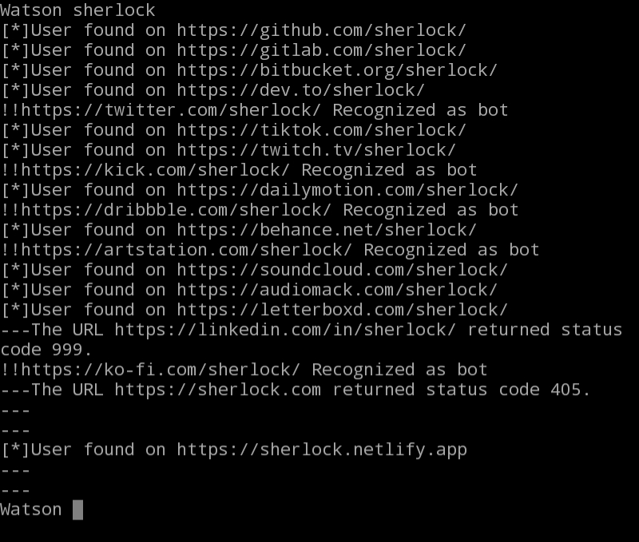

# Watson
A very simple username searcher tool. 

 
<b>It uses python's <i>requests</i> module to search for usernames on various platforms.
</b> 
<h2>Usage</h2>

<b>1.</b> Clone this repository to your local machine. 
<b>2.</b> Run the Watson.py file. 
<b>3.</b> Input an username to search. 

<h2>License</h2>

⚖ This project is licensed under Mozila Public License 2.0
